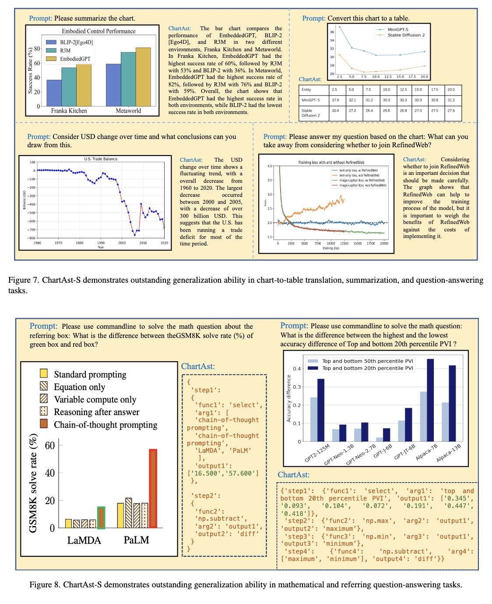

# ChartAssisstant: A Universal Chart Multimodal Language Model via Chart-to-Table Pre-training and Multitask Instruction Tuning

This is the PyTorch implementation of the paper **ChartAssisstant: A Universal Chart Multimodal Language Model via Chart-to-Table Pre-training and Multitask Instruction Tuning**, the paper is available at (https://arxiv.org/abs/2401.02384)

**This repo is built upon [LLaMA2-Accessory](https://github.com/Alpha-VLLM/LLaMA2-Accessory/tree/main)**

## ChartAssisstant

Charts play a vital role in data visualization, understanding data patterns, and informed decision-making. However, their unique combination of graphical elements (e.g., bars, lines) and textual components (e.g., labels, legends) poses challenges for general-purpose multimodal models. While vision-language models trained on chart data excel in comprehension, they struggle with generalization and require task-specific fine-tuning. To address these challenges, we propose ChartAssistant, a chart-based vision-language model for universal chart comprehension and reasoning. ChartAssistant leverages ChartSFT, a comprehensive dataset covering diverse chart-related tasks with basic and specialized chart types. It undergoes a two-stage training process, starting with pre-training on chart-to-table parsing to align chart and text, followed by multitask instruction-following fine-tuning. This approach enables ChartAssistant to achieve competitive performance across various chart tasks without task-specific fine-tuning. **Experimental results demonstrate significant performance gains over the state-of-the-art UniChart method, outperforming OpenAI's GPT-4V(ision) on real-world chart data.** 




## Environment
It is same as [LLaMA2-Accessory](https://github.com/Alpha-VLLM/LLaMA2-Accessory/tree/main)**

## Inference

replace pretrained_path as the pretrained model path
```
sh accessory/exps/finetune/mm/test.sh
# run accessory/single_turn_eval.py
```

## Training
```
sh accessory/exps/finetune/mm/chart.sh
# run accessory/main_finetune.py
```


## To Do List

- [x] Create the git repository.

- [ ] Open source the model and model weight.

- [x] Open source the inference script.

- [ ] Open source the training scripts and the dataset (ChartSFT).

  

